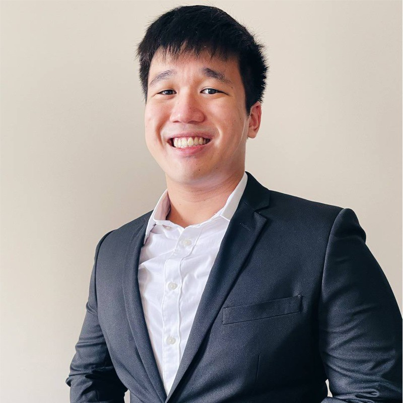
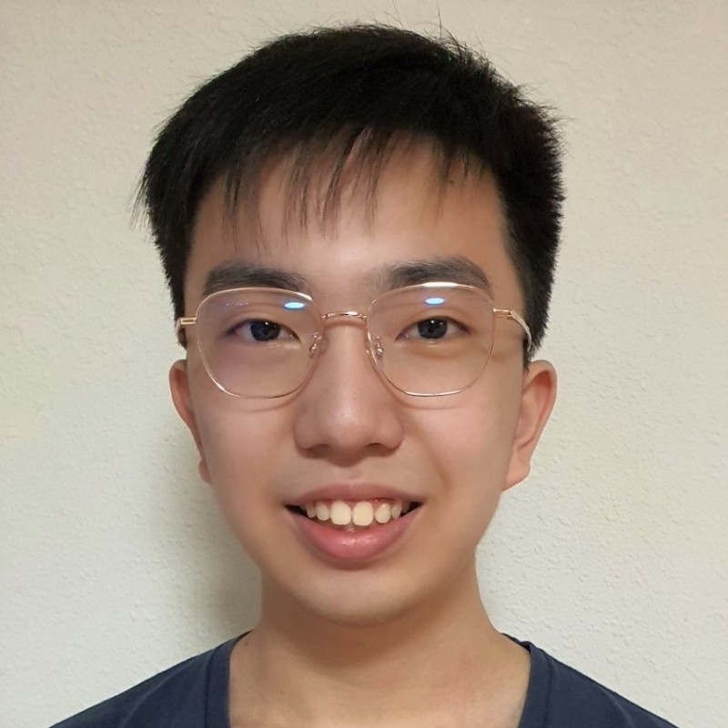
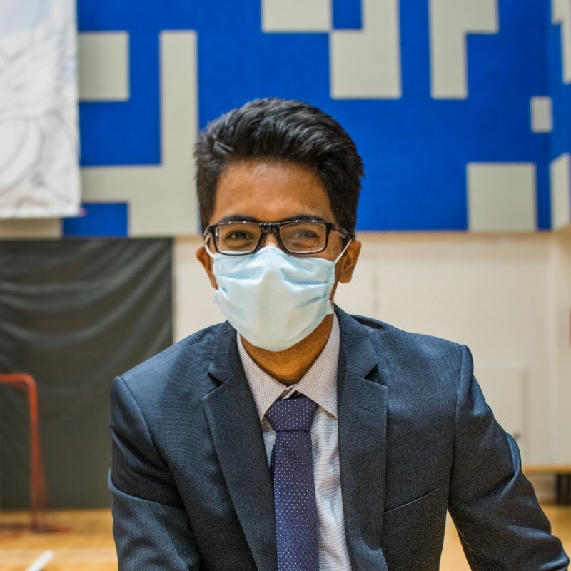

# Samuel Cheong W.S.

  
   
  
  

 

  
   

<!---

# Samuel Cheong W.S.

Undergraduate Student in National University of Singapore

I am an aspiring programmer, interested to automate tasks to improve our quality of life.

## Education

###National University of Singapore
Bachelor of Computing (Hons)
Computer Sciences Courses

###Hwa Chong Institution
IP Programme

-->

Useful Links:  [editor on GitHub](https://github.com/samuelcheongws/Github-website/edit/main/README.md) · [Jekyll](https://jekyllrb.com/) · [GitHub Flavored Markdown](https://guides.github.com/features/mastering-markdown/) · [repository settings](https://github.com/samuelcheongws/Github-website/settings/pages) · [documentation](https://docs.github.com/categories/github-pages-basics/) · [contact support](https://support.github.com/contact)
